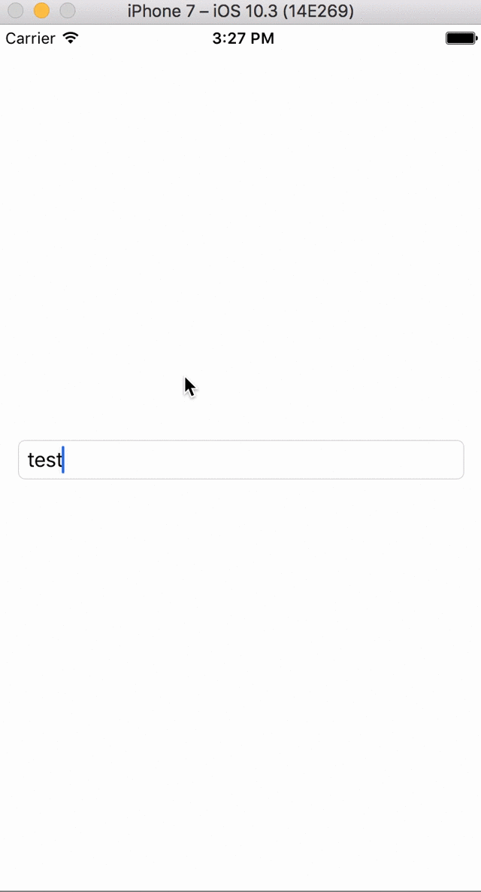

# UITextFieldJumpBug
Repo showcasing iOS 10 bug of `UITextField`'s content jumping half a pixel when in edit mode, on iOS 10

## Steps to reproduce

1. Launch sample application
2. Type some text into the `UITextField`
3. Press outside it in order to dismiss the keyboard
4. Watch how the content that was typed jumps half a pixel between edit mode / normal mode.

## Expected results

- Content should not jump

## Actual results

- Content jumps half a pixel, if the font is 16px (System - San Francisco Regular) and under certain devices:

e.g. Does NOT jump for iPhone 6/6s/7 Plus with a font of 16px, but it DOES jump for 6/6s/7

## Configuration

- iPhone 7 / Simulator

## Version & Build

- iOS 10.3.1 [14E304]

## Additional Notes

- Does not happen on iOS 9.3
- On iOS 10.3.1, it happens on iPhone 7 / simulator, if the system font is regular + 16px. If the font size is changed to 15.5px it fixes it, but starts jumping on iPhone 6/6s/7 Plus instead.

**Radar:** 31580117